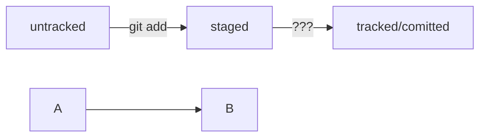

### correct mistake to the commit
* **git commit --amend**  -  исправить последний коммит - можно исправлять сообщение коммита или перезатирать его файлы - но только для незапушенных изменений
* **git commit --amend --no-edit**  - добавить к последнему коммиту новые файлы (из стейджинг зоны)
* **git commit --amend -m "new message"**  - изменить сообзение к коммиту
*если не указать флаги - тогда откроется редактор кода - для указания необходимых изменений* 

### restore file
* **git restore --staged filename.ext** - откатить изменения файла filename.ext из стейдж зоны в антрекед- т.е. перед коммитом

* **git restore <file>** - если просто изменили случайно файл и его нужно откатить к исходной версии и если не успели сделать add

### reset commit
* **git reset --hard** commitHash - насильно откатиться к указанному коммиту - тогда, все что было после него не вернешь

### look at file changes
* **git diff** - покажет разницу последнего закомиченного состояния и текущего состояния - в консоли (по умолчанию только в modified files)

**после git add - git diff уже ничего не выведет**
* **git diff --staged** - для файлов в стейдже

* **git diff hash1 hash2** - сравниваем коммиты с hash1 и hash2 т.е. выведется список инструкций как превратить hash1 в hash2 (для обратного порядка надо указать коммиты наоборот)
**вместо hash - можно использовать HEAD**

* **git branch** - мотреть все ветки проекта

* **git branch <название_ветки>** - создать новую ветку с именем <название_ветки>

* **git branch -a**  - покажи все известные ветки, как локальные (в локальном репозитории), так и удалённые (в origin, или на GitHub).

*Название ветки в Git может состоять из букв, цифр, а также включать любой из четырёх символов: ., -, _, /. Эти символы не несут особого смысла. Например, ветка feature/add-branch-info могла бы называться feature_add-branch-info или feature-add-branch. Bетки не образуют иерархии, как директории, разделённые символом /.*

* **git checkout <название_ветки>**  - переключиться на ветку <название_ветки>

* **git checkout -b <название_ветки>**  - создать и сразу переключиться на сощданную ветку

* **git diff <название_ветки1> <название_ветки2>**  - сравниваем две ветки

* **суффикс навигации - _~_** - для облегчения задачи сравнения в Git есть суффикс навигации ~N, где N — это число. Он отсчитывает от заданного коммита N коммитов назад. Нумерация начинается с нуля: commit~0 — это сам коммит, commit~1 — предыдущий, commit~2 — предшествующий предыдущему и так далее. HEAD~1 — это следующий за текущим коммит. А main~5 — это пятый коммит в ветке main, если считать с последнего выполненного коммита
**Для HEAD~1 есть сокразение HEAD~**

* **git merge <название_ветки>**  - перед тем как начать процесс слияния, нужно перейти в ветку, __куда__ должны добавиться изменения. Затем вызовите команду git merge * *с именем присоединяемой ветки*

* **git branch -D <название_ветки>** - Удалить ветку после объединения. После того как произошло слияние, ветку-донора можно удалить. Для этого в основной ветке введите команду git branch с флагом -D (от англ. delete — «удалить») и названием ветки.

**У команды git branch -D есть более безопасный вариант с флагом __-d__. Он удалит ветку только если она была полностью объединена с другой — то есть если две ветки стали (или изначально были) частью одной истории. Например, если вы нечаянно создали ветку с неправильным названием, её можно удалить через git branch -d %имя_ветки%. **

* **git push** - отправить локальную ветку в удалённый репозиторий
* **git push -u origin <name_branch>** - первый пуш если так сделать - то ветки привяжутся - и потом можно просто git push делать
* **git push --set-upstream origin HEAD** - аналог (полная версия _git push -u_) - HEAD - вместо названия текущей ветки 

* **git pull** - забрать изменения из удалённого репозитория
**Обычно *git pull* — это первая команда, которую вводит разработчик, как только открывает код проекта, чтобы начать с ним работать.Дополнительно *git pull и git merge* выполняют перед тем, как создать пул-реквест**

### Клонирование чужого репозитория
* git clone git@github.com:YandexPraktikum/first-project.git (от англ. clone, «клон», «копия») — склонируй репозиторий с URL first-project.git из аккаунта YandexPraktikum на мой локальный компьютер.

### Состояние fast-forward
* Две ветки находятся в состоянии fast-forward, если одну из них можно «перемотать» вперёд и она будет содержать те же коммиты, что и другая. Это утверждение можно сформулировать иначе:
- при слиянии этих двух веток никак не возможен конфликт;
- истории этих двух веток не «разошлись»;
- одна ветка является продолжением другой.

*Fast-forward слияние веток можно отключить флагом __--no-ff__. Например: git merge --no-ff add-docs. Также его можно отключить «навсегда» (до тех пор, пока вы не вернёте настройку «как было») с помощью настройки merge.ff: git config [--global] merge.ff false.*

*Если отключить слияние в режиме fast-forward, вместо «перемотки» ветки Git создаст в ней коммит слияния (англ. merge commit)*

* *git merge --no-edit --no-ff branch_name - --no-edit отключает ввод сообщения для merge-коммитаб, --no-ff отключает fast-forward слияние веток*

* **git log --graph --oneline** - Git нарисует ветки с помощью «палочек» и «звёздочек».

* **git push --force** - усиленный пуш - просто вольет коммиты из ветки, а в ветке удаленного репозитория просто затрет коммиты, которые были в конфликте.
